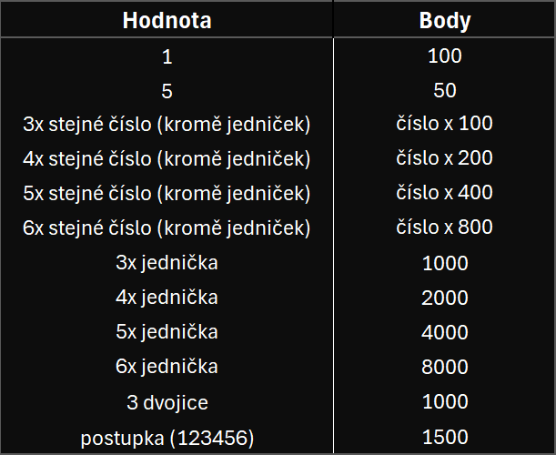

# Kostky

## Informace

Kostky jsou krátký python program, který nahrazuje herní kostky ve hře <i>kostky</i>

## Jak to funguje?

Program vygeneruje 6 náhodných čísel, které uloží do listu a vypíše je uživatelovi. Poté list projde přes logickou část, kde se sečte maximální počet bodů z aktuálního hodu s celkovým počtem bodů. Na začátku programu je potřeba nastavit limit skóre.

## Pravidla hry

